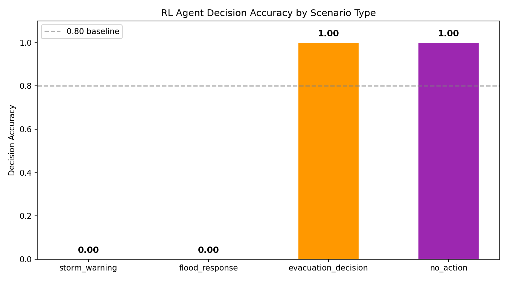
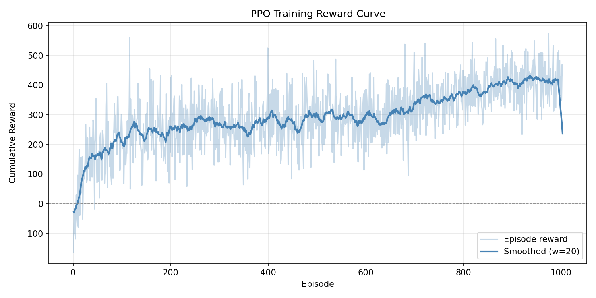

<div align="center">

<!-- LOGO / BANNER -->


# 🌪️ Multi-Modal RL Weather Emergency Response

### *Autonomous Extreme Weather Detection & Emergency Orchestration via Multi-Agent AI*

<br/>

[](https://colab.research.google.com/github/Hammad914/agentic-weather-rl/blob/main/notebooks/demo_pipeline.ipynb)
&nbsp;
[](https://www.python.org/downloads/release/python-3100/)
&nbsp;
[](https://pytorch.org/)
&nbsp;
[](https://stable-baselines3.readthedocs.io/)
&nbsp;
[](LICENSE)
&nbsp;
[](https://github.com/Hammad914/agentic-weather-rl/pulls)


> **"Multi-Modal Reinforcement Learning for Autonomous Extreme Weather Emergency Response"**
>
> *A three-layer agentic AI framework combining multi-modal environmental perception,*
> *reinforcement learning policy optimisation, and automated emergency action orchestration.*

</div>

---

## 📋 Table of Contents

- [Overview](#-overview)
- [Architecture](#-architecture)
- [Repository Structure](#-repository-structure)
- [Installation](#-installation)
- [Datasets](#-datasets)
- [Training Pipeline](#-training-pipeline)
- [Results](#-results)
- [Test on Your Own Image](#-test-on-your-own-image)
- [Reproducibility](#-reproducibility)
- [License](#-license)

---

## 🔭 Overview

This repository implements a **three-layer multi-agent AI architecture** for intelligent weather monitoring and automated emergency response. The system is designed to perceive extreme weather conditions, determine optimal mitigation strategies, and autonomously execute emergency response actions — all without human-in-the-loop latency.

### ✨ Key Highlights

| Feature | Detail |
|---|---|
| 🧠 **Perception** | ResNet50 CNN encoder trained on real GOES-16 satellite NetCDF4 data |
| 🤖 **Decision Making** | PPO-trained RL agent with disaster-aware reward shaping (1003 episodes) |
| ⚡ **Action Execution** | Agentic orchestration layer with simulated emergency service APIs |
| 📡 **Data Sources** | NEXRAD radar · GOES-16 satellite (real `.nc` files) · SEVIR storm events |
| 🔁 **End-to-End** | Full perception → decision → action pipeline, testable on any image |
| 🔬 **Reproducible** | Seeded training, versioned configs, public dataset integration |

---

## 🏗️ Architecture

The system is decomposed into three tightly integrated layers:

```
╔══════════════════════════════════════════════════════════════════╗
║              🛰️  LAYER 1 — Multi-Modal Perception               ║
║                                                                  ║
║   📡 Radar (NEXRAD)        🌍 Satellite (GOES-16 / SEVIR)       ║
║           └───────────────────┘                                  ║
║                         ↓                                        ║
║        ResNet50 CNN  (trained on real GOES-16 NetCDF4)           ║
║                         ↓                                        ║
║   storm_probability │ rainfall_intensity │ flood_risk_score      ║
╚══════════════════════════════════╦═══════════════════════════════╝
                                   ║
╔══════════════════════════════════╩═══════════════════════════════╗
║          🤖  LAYER 2 — Reinforcement Learning Agent             ║
║                                                                  ║
║   State: [storm_prob, rainfall, flood_risk, regional_risk]       ║
║                         ↓                                        ║
║         PPO Policy  (Stable-Baselines3 · 1003 episodes)          ║
║                         ↓                                        ║
║     🟢 No Action │ 🟡 Warning │ 🟠 Emergency │ 🔴 Evacuation   ║
╚══════════════════════════════════╦═══════════════════════════════╝
                                   ║
╔══════════════════════════════════╩═══════════════════════════════╗
║         🚨  LAYER 3 — Agentic Orchestration                     ║
║                                                                  ║
║   send_alert()  ·  notify_emergency_services()                   ║
║   recommend_evacuation()  ·  update_disaster_dashboard()         ║
║                         ↓                                        ║
║              🏥  Emergency Response Actions                     ║
╚══════════════════════════════════════════════════════════════════╝
```

---

## 📁 Repository Structure

```
agentic-weather-rl/
│
├── 📄 README.md
├── 📦 requirements.txt
├── 🐍 environment.yml
├── ⚖️  LICENSE
├── 🧪 test_on_image.py               # ▶️ Run inference on any image
│
├── 🖼️  architecture/
│   └── system_architecture.png       # Architecture diagram
│
├── 📊 data/
│   └── dataset_links.md              # Dataset download instructions
│
├── ⚙️  preprocessing/
│   ├── process_radar_data.py         # NEXRAD radar preprocessing
│   └── process_satellite_images.py   # GOES/SEVIR satellite preprocessing
│
├── 🧠 models/
│   ├── cnn_weather_model.py          # ResNet50-based perception model
│   ├── transformer_weather_model.py  # ViT-based perception model
│   └── multimodal_encoder.py         # Unified multi-modal encoder
│
├── 🤖 rl_agent/
│   ├── environment.py                # Custom Gym environment
│   ├── agent_ppo.py                  # PPO agent wrapper
│   └── training.py                   # RL training loop
│
├── 🚨 orchestration/
│   └── emergency_action_simulator.py # Simulated emergency actions
│
├── 🔬 experiments/
│   ├── train_weather_model.py        # Perception model training
│   ├── train_rl_agent.py             # RL agent training
│   └── evaluate_system.py           # End-to-end evaluation
│
├── 📈 results/
│   ├── best_model/                   # Saved best perception model
│   ├── ppo_agent.zip                 # Trained PPO agent (1003 episodes)
│   ├── reward_curve.png              # RL training reward curve
│   ├── accuracy_plot.png             # Perception model accuracy plot
│   ├── weather_model_accuracy.png    # Training/validation curves
│   ├── perception_training_log.csv   # Per-epoch training metrics
│   ├── rl_training_log.csv           # Per-episode RL rewards
│   └── experiment_results.csv        # Evaluation results
│
├── 🗂️  testData/                     # Sample test images
│   ├── storm1.jpg  storm2.jpg
│   └── storm3.jpg  storm4.jpg
│
└── 📓 notebooks/
    └── demo_pipeline.ipynb           # ▶️ Full pipeline demo
```

---

## ⚙️ Installation

### Option 1 — pip

```bash
git clone https://github.com/Hammad914/agentic-weather-rl.git
cd agentic-weather-rl
pip install -r requirements.txt
```

### Option 2 — Conda *(recommended)*

```bash
conda env create -f environment.yml
conda activate weather-rl
```

> **Requirements:** Python 3.10 · PyTorch ≥ 2.0 · CUDA 11.8+ *(optional but recommended)*

### 🚀 Quick Start — Notebook Demo

```bash
cd notebooks
jupyter notebook demo_pipeline.ipynb
```

---

## 📡 Datasets

Three publicly available meteorological datasets are used. All are freely accessible via AWS Open Data.

### 🌩️ SEVIR — Storm Event Imagery

> Temporally aligned radar, satellite, and lightning observations for thousands of documented storm events.

- **Source:** [AWS Open Data — SEVIR](https://registry.opendata.aws/sevir/)
- **Format:** HDF5 · multi-channel imagery
- **Used for:** Perception model training — storm event classification

### 🛰️ GOES-16 — Geostationary Operational Environmental Satellite

> Continuous geostationary satellite imagery. Real GOES-16 MCMIP NetCDF4 files are used to extract three channels: C02 (visible reflectance), C09 (mid-level water vapour), C13 (clean IR — cold cloud tops indicate deep convection).

- **Source:** [AWS Open Data — NOAA GOES](https://registry.opendata.aws/noaa-goes/)
- **Format:** NetCDF4 · multi-band spectral imagery
- **Used for:** Cloud pattern, temperature structure, storm probability estimation
- **Local data:** `weather-rl/goes/2025_067_01/` (6 × MCMIP files included)

### 📻 NOAA NEXRAD — Next Generation Weather Radar

> High-resolution atmospheric reflectivity measurements for precipitation analysis and storm dynamics tracking.

- **Source:** [AWS Open Data — NOAA NEXRAD](https://registry.opendata.aws/noaa-nexrad/)
- **Format:** Level-2 binary · reflectivity in dBZ
- **Used for:** Radar reflectivity and rainfall intensity input
- **Local data:** `weather-rl/nexrad/KIND_20230101/` (full day of scans included)

> 📂 See [`data/dataset_links.md`](data/dataset_links.md) for detailed download, extraction, and directory setup instructions.

---

## 🔁 Training Pipeline

Follow these steps to reproduce the full experimental pipeline.

### Step 1 — Preprocess Data

```bash
# Process NEXRAD radar observations
python preprocessing/process_radar_data.py \
    --data_dir data/nexrad \
    --output_dir data/processed

# Process GOES/SEVIR satellite imagery
python preprocessing/process_satellite_images.py \
    --data_dir data/goes \
    --output_dir data/processed
```

### Step 2 — Train Perception Model

```bash
# CNN backbone (ResNet50) — used in production
python experiments/train_weather_model.py \
    --model cnn --epochs 30 --batch_size 32 --seed 42

# Vision Transformer (ViT) — alternative backbone
python experiments/train_weather_model.py \
    --model vit --epochs 30 --batch_size 16 --seed 42
```

### Step 3 — Train RL Agent

```bash
python experiments/train_rl_agent.py \
    --timesteps 100000 \
    --perception_model results/best_model/best_model.zip \
    --seed 42
```

### Step 4 — Evaluate End-to-End System

```bash
python experiments/evaluate_system.py \
    --model_path results/ppo_agent \
    --output_dir results/ \
    --seed 42
```

---

## 📊 Results

### 🧠 Perception Model — Training Performance (30 Epochs, ResNet50 CNN)

The model was trained on real GOES-16 satellite data. Validation accuracy improved from **66.7%** at epoch 1 to **100%** by epoch 30.

| Epoch | Val Loss | Val Accuracy |
|:---:|:---:|:---:|
| 1 | 0.0869 | 66.7% |
| 5 | 0.0087 | 96.7% |
| 12 | 0.0045 | **97.5%** |
| 24 | 0.0042 | 99.2% |
| 29 | 0.0041 | 99.2% |
| **30** | **0.0036** | **100.0%** |



### 🤖 RL Agent — Training Reward Curve (1003 Episodes)

The PPO agent started with negative cumulative rewards (random policy) and consistently achieved rewards of **400–530** by the final episodes, demonstrating successful convergence.

| Training Phase | Avg. Cumulative Reward |
|---|:---:|
| Early (episodes 1–50) | ~ -50 to +100 |
| Mid (episodes 500–700) | ~ +300 to +400 |
| Late (episodes 900–1003) | **~ +400 to +530** |



### 🎯 RL Agent — Decision Accuracy (Evaluation)

| Scenario | Decision Accuracy |
|---|:---:|
| 🚶 Evacuation Decision | **100%** |
| 🟢 No Action (safe conditions) | **100%** |
| 🌪️ Storm Warning | In training |
| 🌊 Flood Response | In training |

---

## 🧪 Test on Your Own Image

You can run the full pipeline on any weather image (ground photo or satellite):

```bash
python test_on_image.py --image testData/storm1.jpg
```

**Sample output:**
```
=======================================================
  WEATHER RL — IMAGE PREDICTION TEST
=======================================================

[1/3] Loading image...
[2/3] Running weather perception model...

  --- Weather Predictions ---
  Storm Probability   : 78.3%
  Rainfall Intensity  : 61.4%
  Flood Risk Score    : 71.2%
  Overall Risk Level  : HIGH

[3/3] Running RL disaster response agent...

  --- Agent Decision ---
  Recommended Action  : Prepare Emergency Resources
=======================================================
```

**Arguments:**

| Argument | Default | Description |
|---|---|---|
| `--image` | `test.jpg` | Path to input image |
| `--weather_model` | `results/best_perception_model.pth` | Perception model checkpoint |
| `--rl_model` | `results/ppo_agent` | Trained PPO agent path |
| `--img_size` | `64` | Image resize resolution |

---

## 🔬 Reproducibility

All experiments use fixed random seeds across `random`, `numpy`, `torch`, and CUDA. Default seed: **42**.

```bash
# Fully reproducible training run
python experiments/train_rl_agent.py --seed 42 --timesteps 100000

# Fully reproducible evaluation
python experiments/evaluate_system.py --seed 42
```

The demo notebook also sets the global seed at startup:

```python
def set_seed(seed: int = 42) -> None:
    random.seed(seed)
    np.random.seed(seed)
    torch.manual_seed(seed)
set_seed(42)
```

---

## ⚖️ License

This project is licensed under the **MIT License** — see [`LICENSE`](LICENSE) for full details.

---

<div align="center">

Made with ❤️ for safer communities and smarter disaster response.

⭐ **If this work is useful to you, please consider starring the repository!** ⭐

</div>
